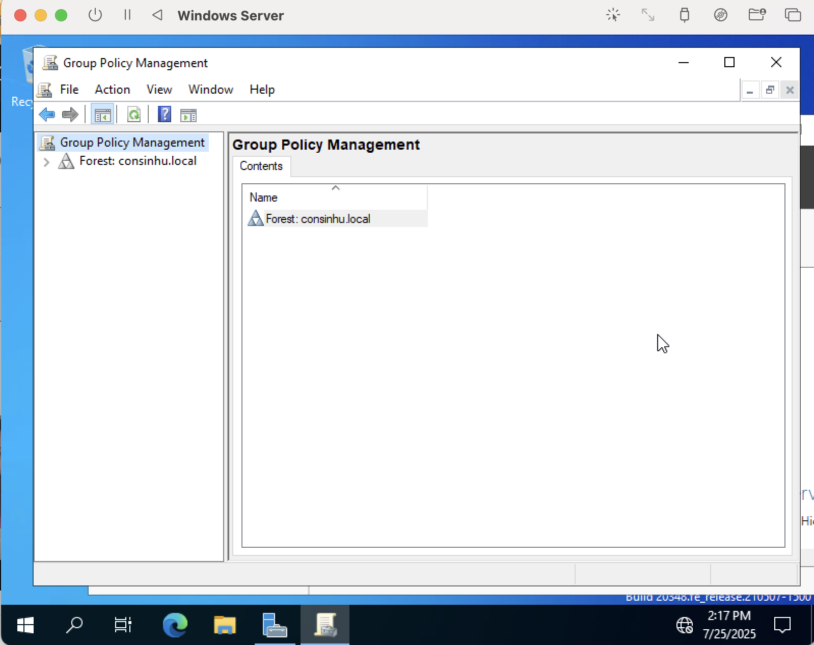
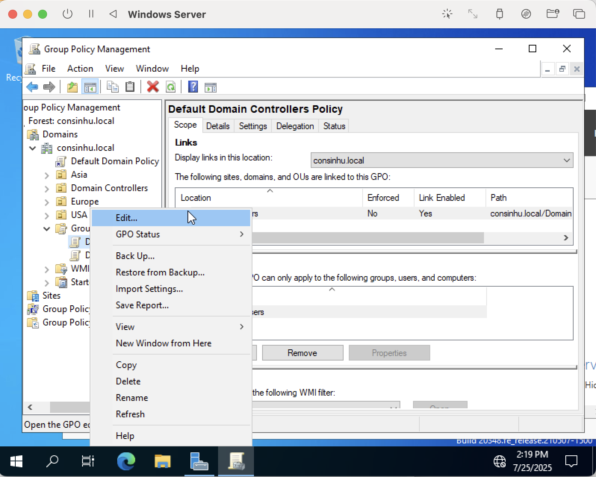
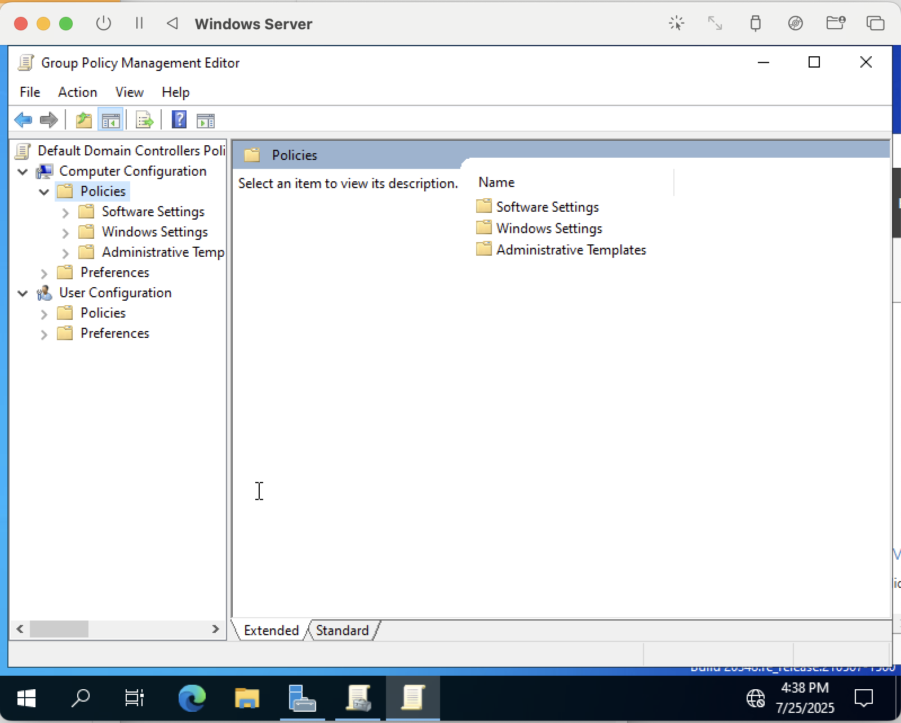
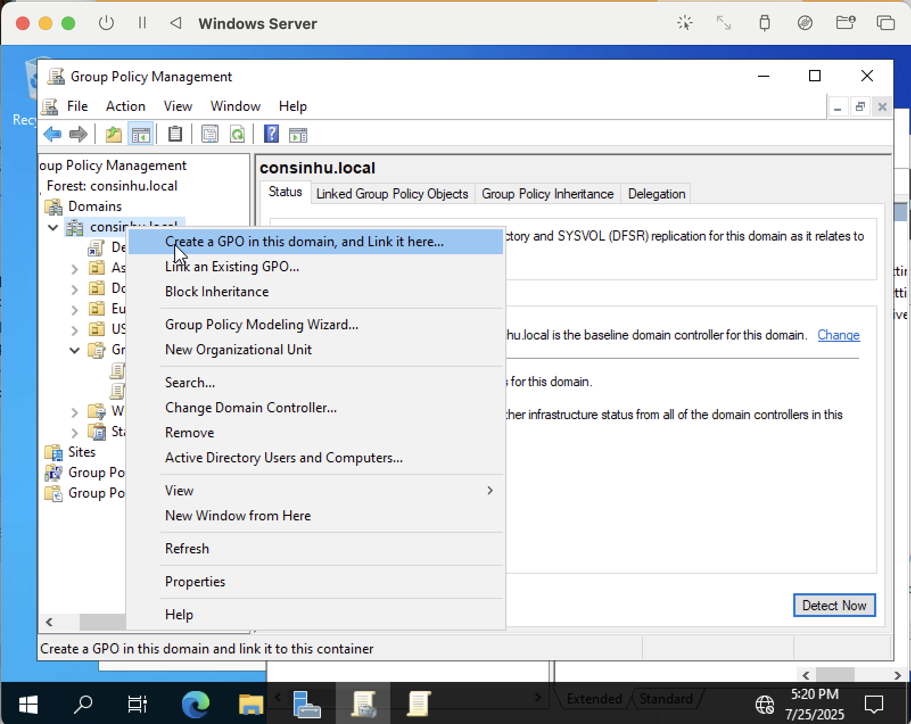
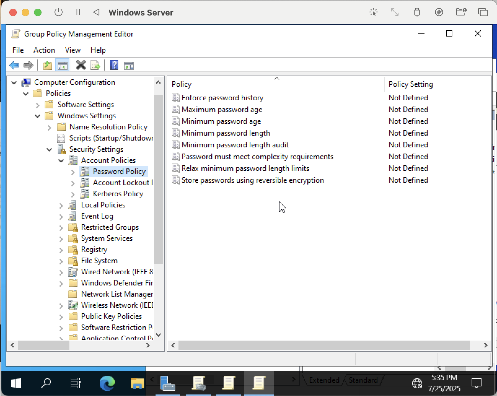
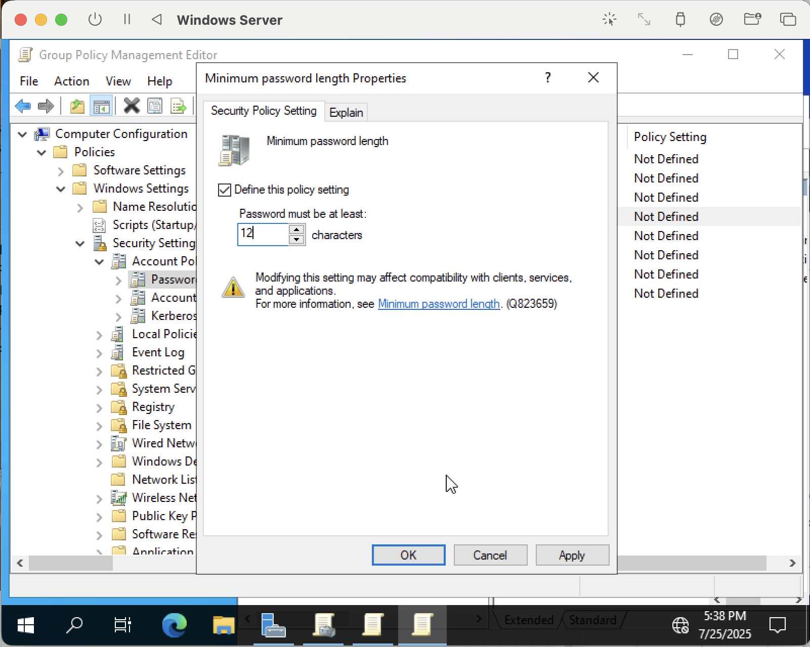
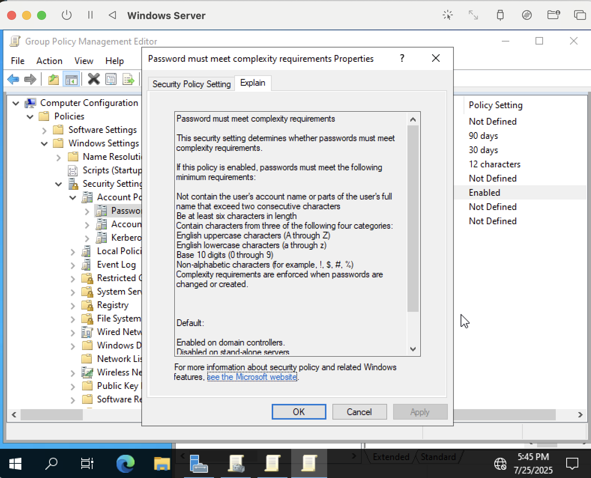
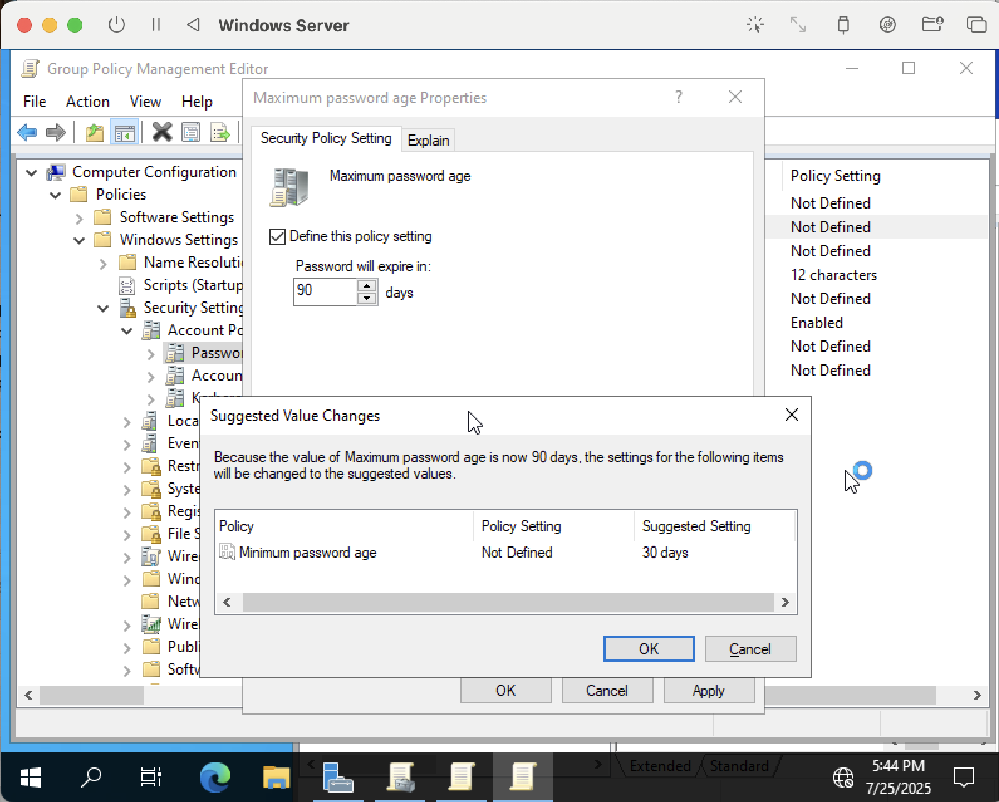

# Active Directory Group Policy Management Lab

 

<h1>Part I: Navigating Group Policy Object (GPO) in On-Premises Active Directory</h1>

I will be demonstrating and explaining the processes of creating, setting up, applying, and testing GPOs in this Group Policy Management lab that is easily implementable through a virtualized Windows Server environment.

GPOs are an important aspect of Active Directory and provide centralized management over various settings and configurations on users' and computers' environments. In terms of what they are, GPOs typically refer to a collection of settings defining what a user or computer is allowed to do on a network. They are administrative tools best for enforcing consistency, stability, and secure network environments.

The cool thing about this lab is you can practice multiple key IT skills at once. Active Directory is such a broad tool that this one lab geared towards Group Policy Management will have you dabbling in cybersecurity policy, desktop configuration and software deployment, remote IT administration, and more!

<h2>What's on the Agenda</h2>

  1. Setting a password policy
  2. Mapping network drives for users
  3. Restricting user access to the control panel
  4. Account lockout policy
  5. Creating and setting up a Windows Client VM
  6. Applying & testing GPOs

**Setting a Password Policy**

Before I get into password policy work, I have to go over how to get to your Group Policy Management or GPM console. Unlike when we were working with Active Directory Users and Computers, GPM will not be in the startup menu. It is actually a separate app that should already be pre-installed on your Windows Server VM. Simply search for it on your VM and it should be the first choice that pops up. Click and open it up. Navigate to your domain, then Group Policy Objects. For the sake of demonstration, right click Default Domain Controllers Policy so we can see what Group Policy Management Editor looks like. 

_This is what GPM should look like when you first launch it_

_Navigating to Group Policy Management Editor will look something like this_ 

In order to create a completely new GPO policy, right-click on your domain of interest and hit "Create a GPO in this domain, and Link it here...". When the pop-up appears, fill in the name of the policy you want to add and make sure it is relevant (in this case, I used the name Password Policy)

Before moving on to the next step, I want to discuss a bit about the different types of group policy settings that appear on the left-hand side of the Group Policy Management Editor. First, there is Computer Configuration vs. User Configuration. Computer Configuration settings apply to the local computer and do not change per user. User Configuration settings are the opposite and apply to users as well as can change depending on specific users. There is also Policies vs. Preferences. Policies settings cannot be changed by users and include password or account lockout policies. On the other hand, preferences are settings that can be altered by users and typically include mapped network drives, printers, and desktop shortcuts. Don't worry! All of this will start to make sense soon.

In order to navigate to the Password Policy configurations, we will look to the Computer Configuration section. This is because a password policy is a type of setting that will not change from user to user and is applies to a computer object, not a user object. We will then navigate to Windows Settings > Security Settings > Account Policies where we will finally find Password Policy. Selecting Password Policy will give us all the different policies for creating, storing, enforcing, etc. passwords.

_I will show how I configured properties for minimum password length, complexity requirements, and maximum password age!_

_Not shown, but in the second screenshot, the Security Policy Setting page is just a checkbox for "Define the policy setting", which will allow you to select to enable complexity requirements for passwords_

For complexity requirements, the Explain section is just a rundown of what the typical password requirements are from Microsoft (think symbols, special characters, lowercase vs. uppercase, etc.). I've shown it just to display the important part highlighting those requirements.

We're done with setting up a password policy! Easy, right? If you want to check your work to make sure everything saved, you can navigate to Password Policy from the GPM console and everything should be as we configured.

