# Active Directory Group Policy Management Lab

 

<h1>Part I: Navigating Group Policy Object (GPO) in On-Premises Active Directory</h1>

I will be demonstrating and explaining the process of creating, setting up, applying, and testing GPOs in this Group Policy Management lab that is easily implementable through a virtualized Windows Server environment.

GPOs are an important aspect of Active Directory and provide centralized management over various settings and configurations on users' and computers' environments. In terms of what they are, GPOs typically refer to a collection of settings defining what a user or computer is allowed to do on a network. They are administrative tools best for enforcing consistency, stability, and secure network environments.

The cool thing about this lab is you can practice multiple key IT skills at once. Active Directory is such a broad tool that this one lab geared towards Group Policy Management will have you dabbling in cybersecurity policy, desktop configuration and software deployment, remote IT administration, and more!

<h2>What's on the Agenda</h2>

  1. Setting a password policy
  2. Mapping network drives for users
  3. Restricting user access to the control panel
  4. Account lockout policy
  5. Creating and setting up a Windows Client VM
  6. Applying & testing GPOs

**Setting a Password Policy**

Before I get into password policy work, I have to go over how to get to your Group Policy Management or GPM console. Unlike when we were working with Active Directory Users and Computers, GPM will not be in the startup menu. It is actually a separate app that should already be pre-installed on your Windows Server VM. Simply search for it on your VM and it should be the first choice that pops up. Click and open it up. Navigate to your domain, then Group Policy Objects. For the sake of demonstration, right click Default Domain Controllers Policy so we can see what Group Policy Management Editor looks like. 

_This is what GPM should look like when you first launch it_

_Navigating to Group Policy Management Editor will look something like this_ 

In order to create a completely new GPO policy, right-click on your domain of interest and hit "Create a GPO in this domain, and Link it here...". When the pop-up appears, fill in the name of the policy you want to add and make sure it is relevant (in this case, I used the name Password Policy)

Before moving on to the next step, let's discuss a bit about the different types of group policy settings that appear on the left-hand side of the Group Policy Management Editor. First, there is Computer Configuration vs. User Configuration. Computer Configuration settings apply to the local computer and do not change per user. User Configuration settings are the opposite and apply to users as well as can change depending on specific users. There is also Policies vs. Preferences. Policies settings cannot be changed by users and include password or account lockout policies. On the other hand, preferences are settings that can be altered by users and typically include mapped network drives, printers, and desktop shortcuts. Don't worry! All of this will start to make sense soon.

In order to navigate to the Password Policy configurations, we will look to the Computer Configuration section. This is because a password policy is a type of setting that will not change from user to user and is applied to a computer object, not a user object. We will then navigate to Windows Settings > Security Settings > Account Policies where we will finally find Password Policy. Selecting Password Policy will give us all the different policies for creating, storing, enforcing, etc. passwords.

_I will show how I configured properties for minimum password length, complexity requirements, and maximum password age!_

_Not shown, but in the second screenshot, the Security Policy Setting page is just a checkbox for "Define the policy setting", which will allow you to select to enable complexity requirements for passwords. Make sure you do both_

For complexity requirements, the Explain section is just a rundown of what the typical password requirements are from Microsoft (think symbols, special characters, lowercase vs. uppercase, etc.). I've shown it just to display the important part highlighting those requirements.

When you hit "Ok" for configuring maximum password age, a popup for minimum password age will appear (assuming you haven't configured it already). I just went with the default of 30 days minimum and a quarter period (90 days) for maximum meaning that users will need to wait 30 days to change a password and users MUST change their passwords every 90 days.

We're done with setting up a password policy! Easy, right? If you want to check your work to make sure everything saved, you can navigate to Password Policy from the GPM console and everything should be as we configured.

**Mapping Network Drives**

Drive mapping is the process of assigning a letter to a user's session where the letter refers to a specific network drive. Doing so will allow users to more easily access files and folders, especially if they are not on their local computer.

For drive mapping, I collected some screenshots to better document the process. First, you will need to right-click on your chosen domain and select "Create a GPO in this domain, and Link it here..."

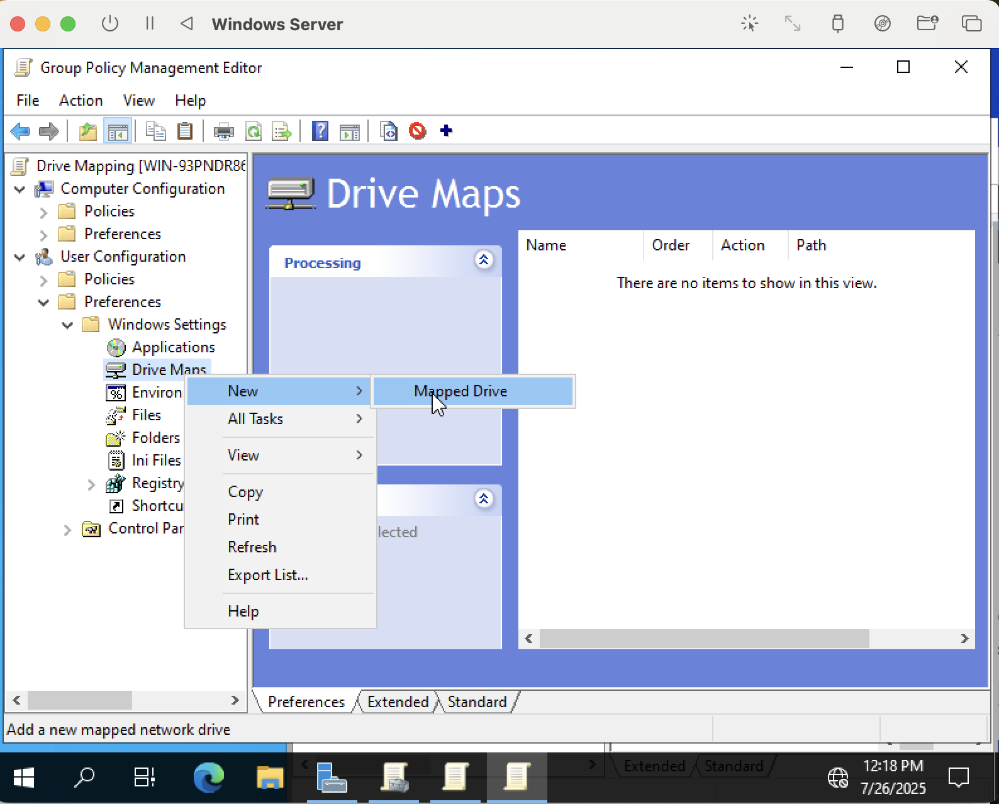

_In Group Policy Management Editor window, navigate to User Configuration because drive mapping is specific to user sessions. Under User Navigation, navigate to Preferences > Windows Settings > Drive Maps > New > Mapped Drive_

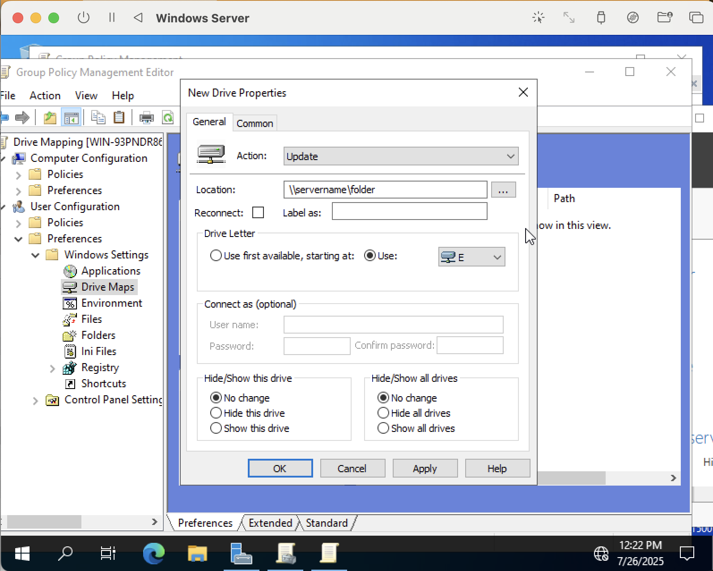

_In New Drive Properties, make sure to specifiy a file path in location field (this one is just an example) and assign a drive letter (select User first)_

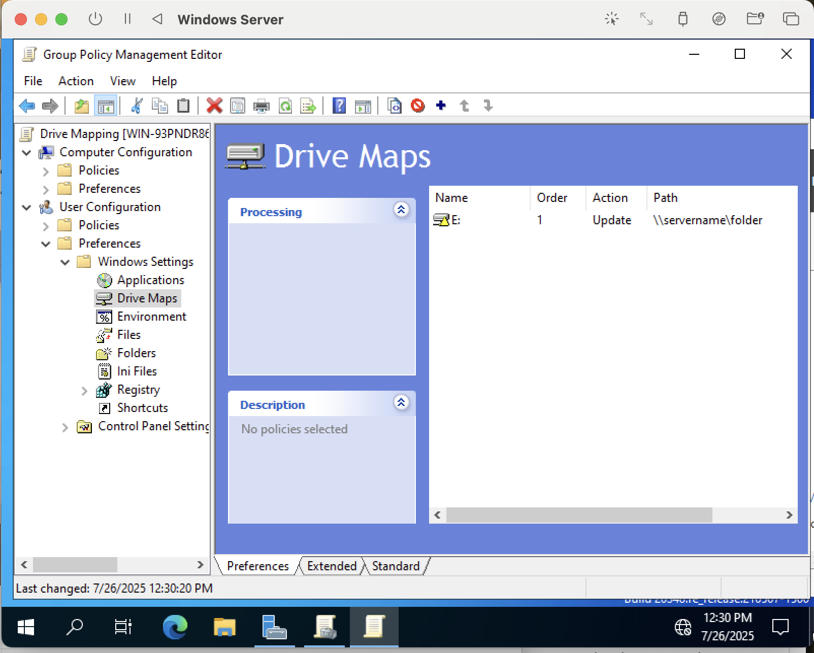

_Resulting display_

**Restricting User Access to Control Panel**

Restricting user access, especially for the control panel, is key to ensuring security and stability in a network environment. This can be accomplished in Active Directory through the following steps. First, you'll want to repeat the steps of right-clicking on your domain name, hitting "Create a GPO in this domain, and Link it here...", then right-clicking and hitting "Edit" on the resulting GPO. Once you are opened up to the GPM Editor window, navigate to User Configuration > Policies > Administrative Templates > Control Panel.

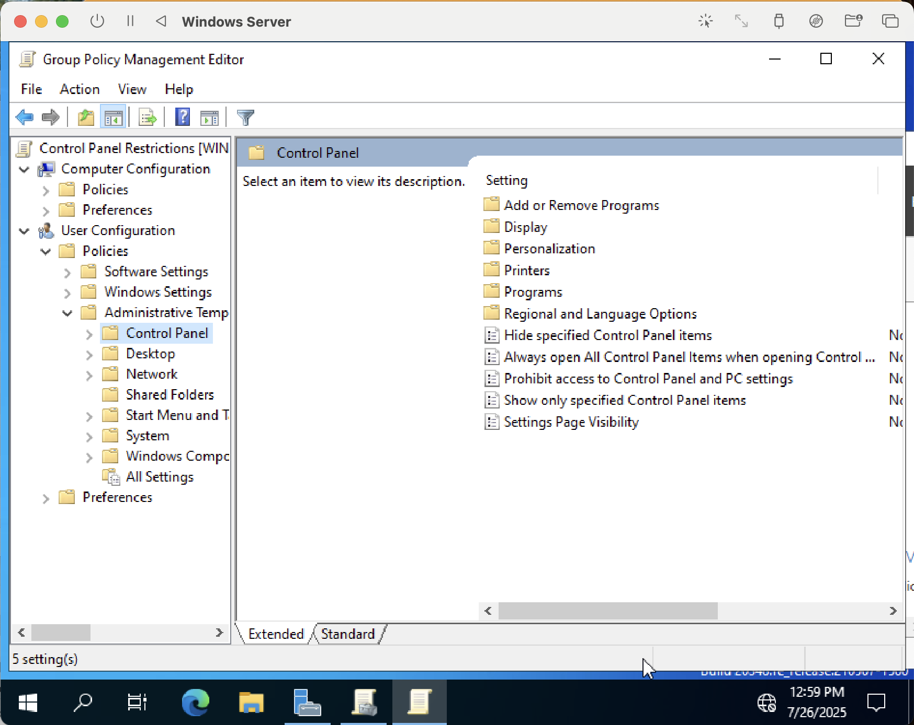

_After completing the above steps, this is what your GPM Editor display should look like_

There are various settings under the Control Panel folder, but for this particular exercise, we will only be configuring the "Prohibit access to Control Panel & PC settings" setting. Right-click and "Edit" setting, then make sure to select the "Enabled" option. That's all you have to do! If you would like to learn more about exactly what this setting does, there is a small, scrollable Help panel in the bottom right. When finished, hit Apply and Ok.

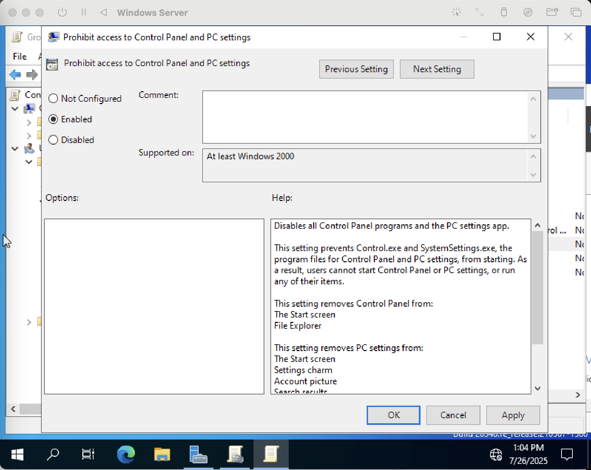

_Edit window for "Prohibit access to Control Panel and PC settings_

Once completed successfully, the setting will have changed from "Not Configured" to "Enabled".

**Account Lockout Policy Configuration**

Now that we're getting the hang of things, I'm going to try and go over configuring an Account Lockout Policy quickly. First, create a new GPO in your domain. We want to head into the GPM Editor and navigate to the Account Lockout tab.

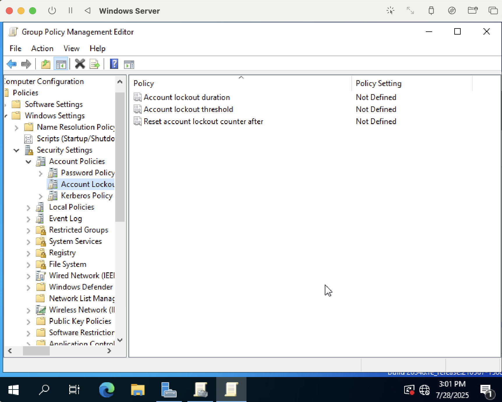

_The above shows the pathway taken to navigate to Account Lockout settings._

Once there, we will need to configure all three settings. Let's say we want to configure things to prevent a brute-force attack. What would that look like?

In general, if we're dealing with brute-force attacks, configuring everything with relatively short durations and intervals would be a good place to start. Specific ranges vary, but I personally learned that between 15-30 min is standard for lockout duration and 5-10 attempts for lockout threshold. A typical reset interval should either match or be shorter than the lockout duration.

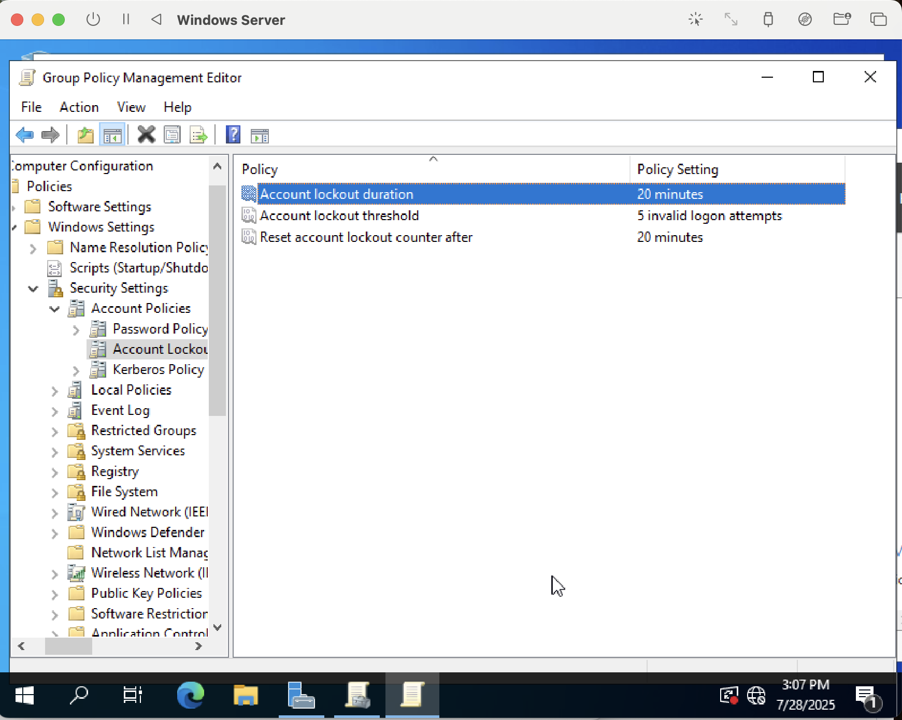

_Once configuration for one setting is in place, pressing Apply or OK will lead to another window with suggestions for the other settings. As long as the above conditions are satisfied, you should be good to go. I simply agreed with the suggested values, but you can alter them if you'd like_

This is the end for Part I of my Active Directory GPO Lab! In Part II, I'm going to putting these policies in motion and simulating a realistic IT administration process.

<h1>Part II: Applying and Testing GPOs in a Client VM</h1>

The objective in this part is to join a computer to the domain created and used in Part I as well as put the GPOs or Group Polices we made in action. I will now go over the steps for doing so.

**Setting Up a Client VM**

First thing's first, we need to launch another Windows VM in UTM, but this time it'll be easier and faster because we just need a typical Windows 10/11 Pro or Enterprise operating system (note: Microsoft is officially stopping updates and patches for all Windows 10 models by October 2025 so it's best to get a Windows 11 VM). Again, I just used the file I had already downloaded from Microsoft which you can find at this link: https://www.microsoft.com/en-us/software-download/windows11arm64. Make sure to note that this is different from Windows Server.

**Configuring a DNS Server and Joining Client VM to Domain**

In your Windows Server VM, navigate to your Network and Internet Settings >  Ethernet > Change Adapter Options > Ethernet Properties > TCP/IPv4 Properties. Enter the IP information into the appropriate spaces. You can find this information by inputting ipconfig command into the command prompt as shown below. In order for accurate details to be returned back, make sure you have internet connection on your VM. If you don't already, you may need to shut down the VM, go into the settings of the VM from the UTM launch window, and change network adapter settings (i.e. changing from Shared Network to Bridged). You might also just need UTM guest tools installed for which there are numerous tutorials online.

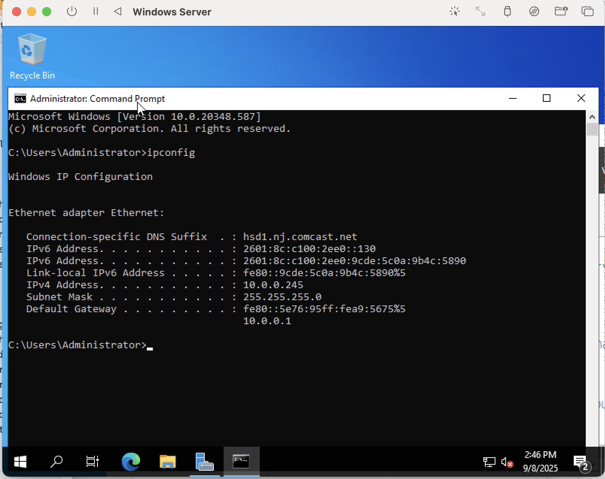

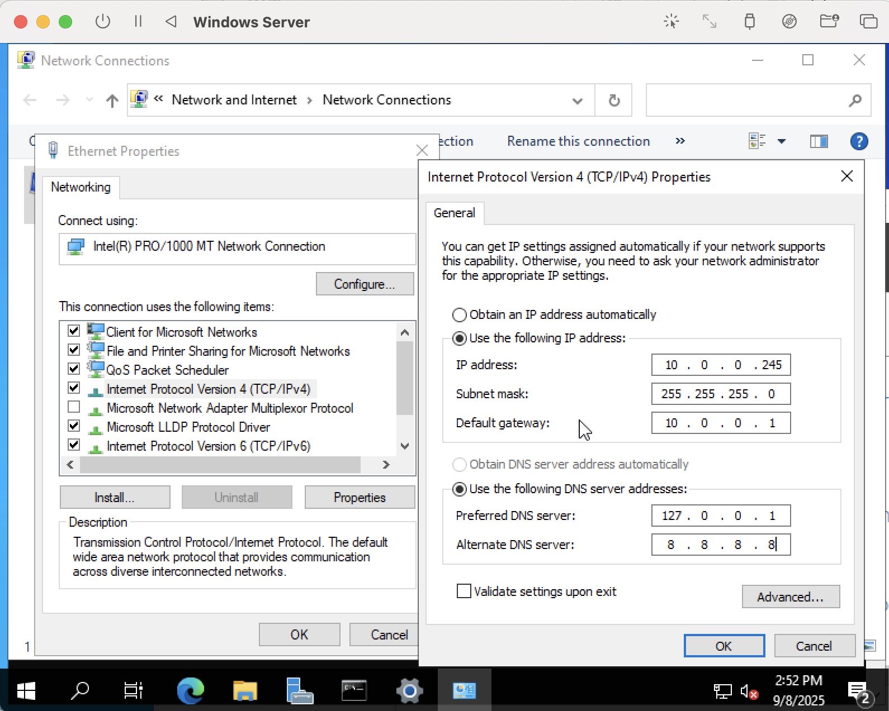

_Map the DNS server for Windows Server back to itself using 127.0.0.1 known as a loopback address. For an alternate DNS server, I just used Google's Public DNS which is open-source and can be used by anyone to resolve DNS services_

Note: Make sure to uncheck the IP Version 6 option as this may cause issues with connecting the client VM to the DNS Server later. I forgot to at first and it gave me a lot of issues later.

After finishing configurations for Windows Server which should now be the Doman Controller (DC), you'll want to do basically the same steps for your Windows client machine as well. Navigate to Control Panel > Network & Internet > Network & Sharing Center > Change Adapter Settings > Ethernet > Properties > TCP/IPv4. 

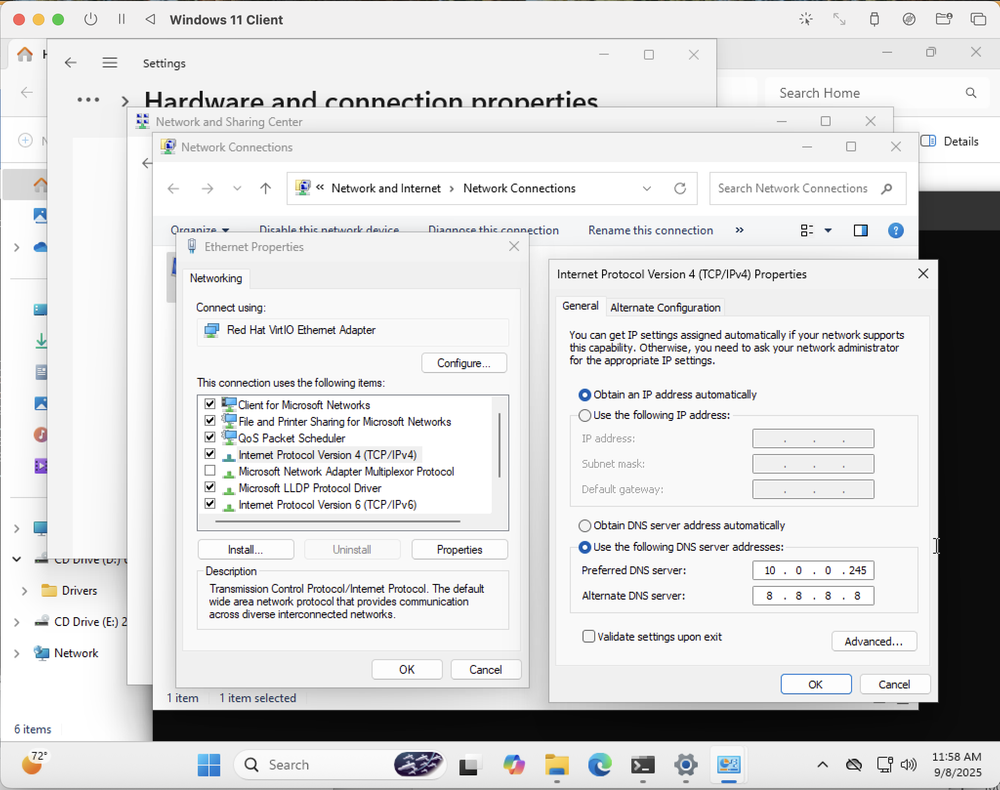 

 _Also disable IPv6 here too. Notice that for the client, we are just configuring the DNS server section of IPv4 Properties. Leave the rest as default!_

 
Once you are finished, it's a good idea to test that the DNS server is actually reachable by pinging the Windows server address (now the static IP for both server and client) in the command prompt. You should also test ping your domain name on the client machine as well. Additional tests like nslookup and ipconfig /all may also be helpful for seeing more information or troubleshooting purposes. During these processes, you want to make sure both client and server machines are up and running. 

 
If both are successful, then you can move on to actually joining the client machine to the domain. To do so, navigate to File Explorer > Right-click This PC > Properties > Advanced system settings > Computer Name > Change. Then rename the machine as you'd like and make sure to input the correct domain name. If completed successfully, a Windows Security pop-up should appear, like the example below, requesting some information. If not, there might be some DNS configuration issues that need troubleshooting (i.e. disabling IPv6, making sure there's Internet connection, etc.)

 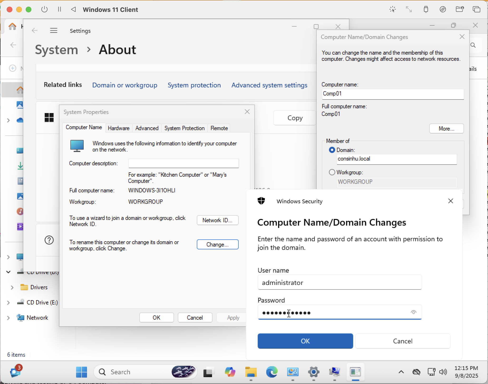

 _After successfuly joining a new domain, the client machine will prompt for a restart_

**Applying GPOs**

In order to apply GPOs in Active Directory, first navigate to Group Policy Management and then to the Group Policy Objects folder. To actually do the applying, you simply drag-and-drop different GPOs to their appropriate folder which depends on what kind of policy they are (computer vs. user). I have provided an example of a proper distribution of GPOs down below.

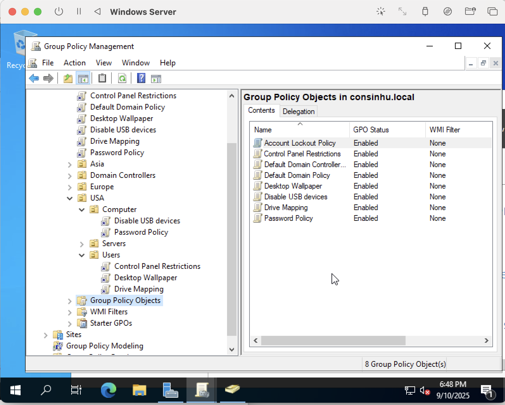

Also, depending on which folder you have just applied the GPOs in, you must also then move the client computer created in this lab to the same geographic location. In my case, my next step would be to move computer COMP01 (the name I renamed my Windows 11 Pro machine) to the USA folder. To do so, you must navigate to Active Directory Users and Computers in the Startup menu and to the Computers folder. Right-click on the client machine > Move > USA > Computers.

**Testing GPOs**

